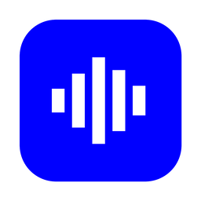

<div align="center">

  

  <h1>Mitschnitt</h1>

  <p><b>Record any meeting. No bot, no account, no cloud.</b></p>
  <p>Meeting notes that never leave your Mac.</p>

  <p>
    <a href="https://github.com/simeonzickert/mitschnitt/releases/latest"><b>Download for macOS</b></a>
    &nbsp;·&nbsp;
    <a href="docs/getting-started.md">Getting started</a>
    &nbsp;·&nbsp;
    <a href="CHANGELOG.md">What's new</a>
  </p>

  <p>
    
    
    
  </p>

</div>

<!-- Screenshot goes here: transcript view with speakers, from a meeting without real client names. -->

## Why Mitschnitt

Most meeting tools send a bot into your call and your conversation into someone else's cloud. Mitschnitt does neither.

- **No bot joins your call.** Mitschnitt records your microphone and your Mac's system audio directly. Zoom, Teams, Meet, a phone call routed through your Mac: if you can hear it, it can write it down.
- **Your recordings stay on your Mac.** Transcription runs locally. Audio, transcripts and notes live in your user folder, not on a server.
- **No account, no subscription, no telemetry.** There is nothing to sign up for and no analytics phoning home.

## Install

1. Download `Mitschnitt-<version>-notarisiert.zip` ("notarisiert" is German for notarized) from the [latest release](https://github.com/simeonzickert/mitschnitt/releases/latest) and unzip it.
2. Drag **Mitschnitt** into your Applications folder and open it. The app is notarized by Apple, so macOS opens it without a warning.
3. Grant the permissions it asks for. Each one is requested only when you click:
   - **Microphone**, for your own voice.
   - **System audio**, for everyone else in the call.
   - **Accessibility**, so the app notices when a call starts.
   - **Calendar** (optional), for meeting titles and participants.

On first launch Mitschnitt downloads its transcription model (about 660 MB). The full walkthrough is in [Getting started](docs/getting-started.md) ([Deutsch](docs/getting-started.de.md)).

**Requirements:** a Mac with Apple Silicon (M1 or newer) and macOS 15 or later.

## What it does

- **Local transcription** with NVIDIA Parakeet (fast) or Whisper large-v3-turbo (slower, better with names and punctuation), both running on your Mac.
- **Who said what.** Your microphone and the other side are recorded as separate channels, and on-device speaker separation tells apart several people in the same room.
- **Names from your calendar.** Recordings pick up the title and participants of the matching calendar event (optional).
- **A vocabulary that learns.** Teach it the names and terms it keeps mishearing, and it corrects them in every transcript.
- **Resume after an accidental stop.** Hit stop too early? One click keeps recording into the same meeting.
- **Search inside transcripts,** with the jump landing on the word, not somewhere near it.
- **Summaries on your terms.** Use Apple Intelligence (macOS 26+), a local model via Ollama or LM Studio, or your own API key for OpenAI, Anthropic or Google. You decide if and where text goes.
- **Plain files, always.** Every meeting also gets a readable folder with Markdown and audio. Your data never depends on the app.
- **Works with your AI tools.** A local `mitschnitt` CLI and MCP server let Claude, Codex and other agents read your meetings. Agents can only propose edits; you approve them in the app.
- **Bring your history.** Import existing meetings from anarlog or Hyprnote.
- **Updates itself,** from this repository's releases, never in the middle of a recording. You can turn this off.

## Privacy

What leaves your Mac, and only then:

| When | What goes out | Where |
| --- | --- | --- |
| You download a transcription model | The model file comes in | Hugging Face |
| The app checks for updates (at launch, then about every 30 minutes) | A version check, and the update itself when there is one | GitHub releases of this repo |
| You add your own AI provider for summaries | The transcript text you summarize | The provider you chose |

No audio ever leaves your Mac unless you configure a cloud transcription provider yourself. There are no crash reports and no usage statistics; the code for them has been removed, not just switched off.

## FAQ

**What does "Mitschnitt" mean?**
It's German for a recording you make of something as it happens. Think of it as "taking it all down".

**Does the other side know I'm recording?**
Mitschnitt doesn't announce itself in the call. Whether you need consent depends on where you and the other people are. Ask first; it's the decent thing to do anyway.

**Why are summaries not fully local yet?**
Transcription is local today. A built-in local language model for summaries is on the roadmap. Until then, Apple Intelligence (macOS 26+) or a local Ollama or LM Studio server keep everything on your Mac.

**Windows?**
Planned. The groundwork is there, local transcription on Windows is not yet.

## Roadmap

- Built-in local model for summaries, no API key needed
- Windows support
- Naming speakers once and recognizing them in later meetings

## Build from source

You need Node.js 22 or later, pnpm 11.1.1, Rust 1.94.0 and the [Tauri v2 prerequisites](https://v2.tauri.app/start/prerequisites/).

```bash
pnpm install --frozen-lockfile
pnpm exec turbo dev:desktop
```

The app is a Tauri v2 desktop app: React and TypeScript in front, Rust underneath.

| Path | Contents |
| --- | --- |
| `apps/desktop` | The macOS app |
| `apps/cli` | The `mitschnitt` command-line tool and MCP server |
| `crates/*` | Rust libraries: audio capture, transcription, speaker separation, storage |
| `plugins/*` | Tauri plugins: local transcription, database, calendar, export, updater |
| `packages/*` | Shared TypeScript packages: editor, database, UI |

Contributions are welcome, see [CONTRIBUTING.md](CONTRIBUTING.md). Security issues go to the address in [SECURITY.md](SECURITY.md), not to a public issue.

## Acknowledgements

Mitschnitt started as a fork of [anarlog](https://github.com/fastrepl/anarlog) by Fastrepl, Inc., and owes its foundation to that project. It has since gone its own way, built around local-first recording and plain files. Mitschnitt is independent and not affiliated with or endorsed by Fastrepl.

Transcription uses NVIDIA Parakeet and OpenAI Whisper models. All third-party components and their licenses are listed in [ATTRIBUTIONS.md](ATTRIBUTIONS.md) and inside the app under **Settings → About**.

## License

[MIT](LICENSE). Some bundled models carry their own terms; see [ATTRIBUTIONS.md](ATTRIBUTIONS.md) before building something commercial on top.
